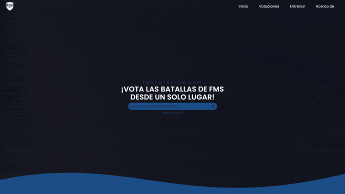
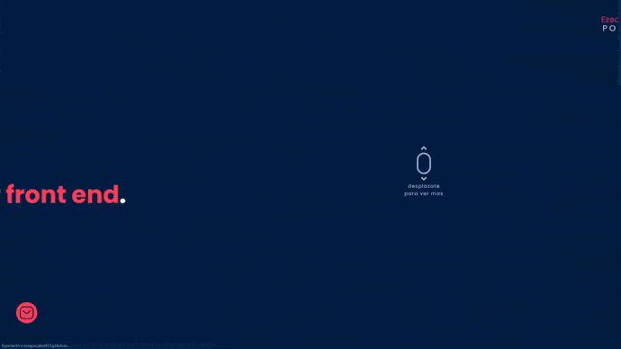
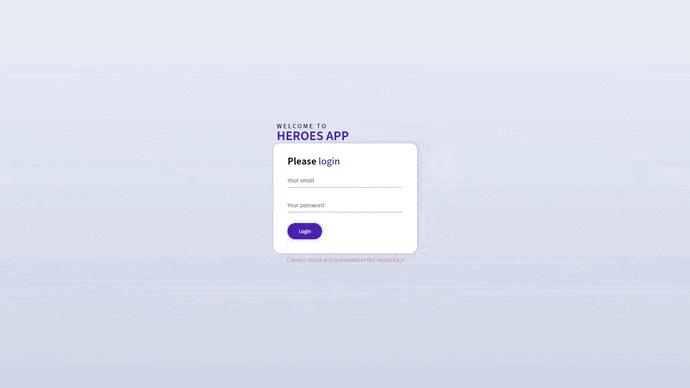
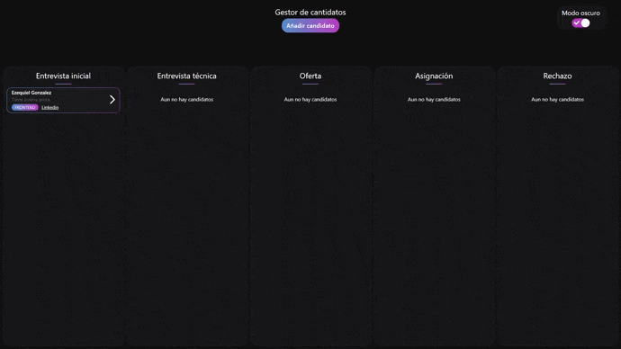
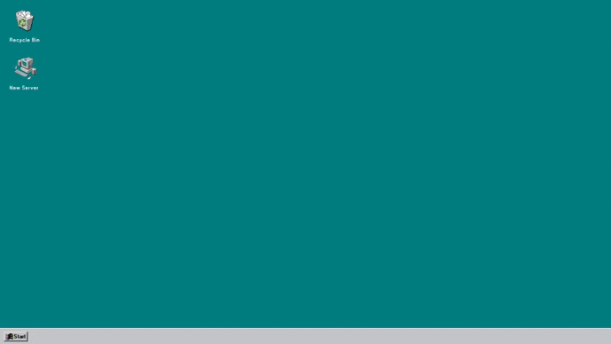
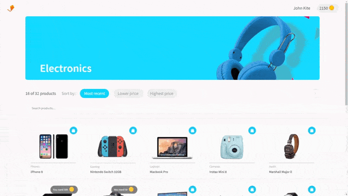

# Hola! 

<h3>Mi nombre es Ezequiel, soy un estudiante de programación informatica, 
apasionado por el desarrollo web,  
aca encontrarás algunos de mis proyectos.</h3>

## Tecnologias

       

## Principales proyectos
<table>
  <tr>
    <td align="center">
      <a href="https://fmsvotacion.com">
         
        
          <b>FMS Votacion</b>
        
      </a>
    </td>
    <td align="center">
      <a href="https://ezegonzalez912.github.io/portafolio/">
         
        
          <b>Portafolio Personal</b>
        
      </a>
    </td>
    <td align="center">
      <a href="https://ezegonzalez912.github.io/challenge-alkemy/#/">
         
        
          <b>Challenge Alkemy</b>
        
      </a>
    </td>
  </tr>
  <tr>
    <td align="center">
      <a href="https://ezegonzalez912.github.io/challenge-softvision/">
         
        
          <b>Challenge Sotfvision</b>
        
      </a>
    </td>
    <td align="center">
      <a href="https://github.com/ezegonzalez912/innovid-challenge">
         
        
          <b>Challenge Innovid</b>
        
      </a>
    </td>
    <td align="center">
      <a href="https://ezegonzalez912.github.io/challenge-aerolab/#/">
         
        
          <b>Challenge Aerolab</b>
        
      </a>
    </td>
  </tr>
</table>

## Github Estadisticas

## Contáctame

